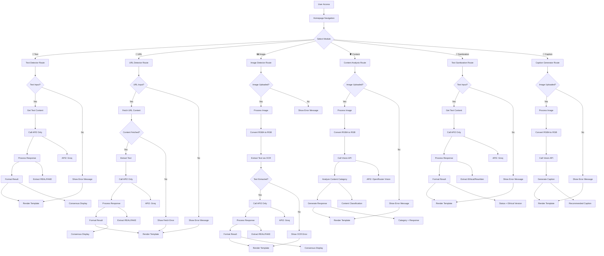

# Fake Information Detector - System Flowchart

## 🔄 Complete Application Flow



## 🎯 Module-Specific Workflows

### **1. Text Detector Workflow**
```
User Input → Text Validation → API2 Call → Response Processing → Result Display
```

**Steps:**
1. User enters text in textarea
2. System validates text is not empty
3. Sends to API2 (Groq - Llama-3.1-8b-instant)
4. Processes response for REAL/FAKE determination
5. Extracts rewritten version if FAKE
6. Formats result with clear structure
7. Renders index.html with results

### **2. URL Detector Workflow**
```
URL Input → Content Fetch → Text Extraction → API2 Call → Response Processing → Result Display
```

**Steps:**
1. User enters URL in input field
2. System validates URL format
3. Fetches content using BeautifulSoup with headers
4. Handles 403/404 errors gracefully
5. Extracts text from HTML content
6. Limits text to 2000 characters
7. Sends to API2 for analysis
8. Processes response and formats result
9. Renders url.html with results

### **3. Image Detector Workflow**
```
Image Upload → Format Conversion → OCR Extraction → API2 Call → Response Processing → Result Display
```

**Steps:**
1. User uploads image file
2. System validates file is image
3. Converts RGBA to RGB for JPEG compatibility
4. Encodes to base64 for display
5. Extracts text using Tesseract OCR
6. Validates extracted text is not empty
7. Sends to API2 for analysis
8. Processes response and formats result
9. Renders image.html with image preview and results

### **4. Content Analysis Workflow**
```
Image Upload → Format Conversion → Vision API → Content Classification → Response Generation → Result Display
```

**Steps:**
1. User uploads image for analysis
2. Converts RGBA to RGB for JPEG compatibility
3. Encodes to base64 for API transmission
4. Sends to OpenRouter GPT-4o vision API
5. Analyzes content for safety classification
6. Generates appropriate response based on category
7. Blocks captions for inappropriate content
8. Renders content-analysis.html with results

### **5. Text Sanitization Workflow**
```
Text Input → Content Analysis → Harm Detection → Ethical Rewriting → Result Display
```

**Steps:**
1. User enters text to sanitize
2. System validates text is not empty
3. Sends to API2 with ethical prompt
4. Detects harmful/fake content
5. Rewrites into ethical version
6. Identifies original issues
7. Formats response with status and changes
8. Renders text-sanitization.html with results

### **6. Caption Generator Workflow**
```
Image Upload → Format Conversion → Vision API → Ethical Caption Generation → Result Display
```

**Steps:**
1. User uploads image for captioning
2. Converts RGBA to RGB for JPEG compatibility
3. Encodes to base64 for API transmission
4. Sends to OpenRouter GPT-4o vision API
5. Analyzes image content ethically
6. Generates neutral, respectful caption
7. Avoids assumptions and stereotypes
8. Renders caption.html with generated caption

## 🔧 Technical Implementation Details

### **Error Handling Flow**
```
Error Detection → Error Classification → User Message → Logging → Graceful Recovery
```

**Error Types:**
- **API Failures** - Network timeouts, key issues
- **File Errors** - Invalid formats, size limits
- **OCR Errors** - Image quality issues
- **URL Errors** - 403, 404, timeouts
- **Processing Errors** - Memory, format issues

### **API Response Processing**
```
Raw API Response → Validation → Content Extraction → Formatting → Display
```

**Response Elements:**
- **Status** - REAL/FAKE/Ethical/Rewritten
- **Confidence** - Agreement level (when multiple APIs)
- **Analysis** - Detailed explanation
- **Rewritten Version** - Corrected content (if applicable)
- **Metadata** - Processing time, API used

## 📊 Performance Considerations

### **Optimization Points**
- **Image Processing** - Efficient base64 encoding
- **Text Limits** - Token management
- **API Timeouts** - 15-30 second limits
- **Memory Management** - Stream processing for large files
- **Concurrent Requests** - Flask development server

### **Scalability Planning**
- **Database Integration** - Store analysis history
- **Caching Layer** - Redis for API responses
- **Load Balancer** - Multiple API keys
- **Background Jobs** - Async processing for large files

---

**Flowchart Status**: ✅ Complete  
**Coverage**: All 6 modules mapped  
**Last Updated**: February 2026
