# Fake Information Detector - Project Documentation

## 📋 Project Overview

A comprehensive Flask web application that detects fake information from multiple sources (text, URL, image) and provides ethical content analysis and sanitization capabilities.

## 🏗️ Architecture

### **Backend Framework**
- **Flask** - Python web framework
- **Python 3.9+** - Core language
- **Modular Design** - Separate routes for each function

### **API Integration**
- **OpenRouter (API1)** - GPT-4o-mini model
- **Groq (API2)** - Llama-3.1-8b-instant model  
- **DeepSeek (API3)** - Available but currently disabled

### **External Services**
- **Tesseract OCR** - Text extraction from images
- **BeautifulSoup4** - Web scraping for URL content
- **Base64 Encoding** - Image processing for display

## 🎯 Core Modules

### **1. 📝 Text Detector** (`/`)
**Purpose**: Analyze text content for fake information
**Input**: User-provided text
**Process**: 
- Send text to active APIs
- Get consensus/agreement
- Rewrite fake content
**Output**: REAL/FAKE + rewritten version if fake

### **2. 🔗 URL Detector** (`/url`)
**Purpose**: Analyze web content for fake information
**Input**: News/article URL
**Process**:
- Fetch content using BeautifulSoup
- Extract text from HTML
- Send to APIs for analysis
- Handle website blocking
**Output**: REAL/FAKE + rewritten version if fake

### **3. 🖼️ Image Detector** (`/image`)
**Purpose**: Extract and analyze text from images
**Input**: Image file (JPG, PNG, etc.)
**Process**:
- Convert image to base64 for display
- Extract text using Tesseract OCR
- Send extracted text to APIs
- Handle RGBA to RGB conversion
**Output**: REAL/FAKE + rewritten version if fake

### **4. 🛡️ Content Analysis** (`/content-analysis`)
**Purpose**: Ethical image moderation and safety classification
**Input**: Image file
**Process**:
- Classify content into 5 categories
- Generate safe captions for appropriate content
- Block captions for inappropriate content
**Categories**: Safe, Child-sensitive, Adult, Violent, Sensitive

### **5. 🧹 Text Sanitization** (`/text-sanitization`)
**Purpose**: Clean harmful content from text
**Input**: Any text content
**Process**:
- Detect fake/misleading information
- Remove hate speech and profanity
- Rewrite into ethical version
**Output**: Ethical/Rewritten + original issue

### **6. 📝 Caption Generator** (`/caption`)
**Purpose**: Generate ethical social media captions
**Input**: Image file
**Process**:
- Analyze image content visually
- Generate neutral, respectful captions
- Avoid assumptions and stereotypes
**Output**: Ethical caption for social media

## 🔄 Data Flow

```mermaid
graph TD
    A[User Input] --> B{Input Type}
    B -->|Text| C[Text Detector]
    B -->|URL| D[URL Detector]
    B -->|Image| E[Image Detector]
    B -->|Image| F[Content Analysis]
    B -->|Text| G[Text Sanitization]
    B -->|Image| H[Caption Generator]
    
    C --> I[API Processing]
    D --> J[Web Scraping]
    E --> K[OCR Extraction]
    F --> L[Vision API]
    G --> M[API Processing]
    H --> N[API Processing]
    
    J --> I
    K --> I
    L --> O[Consensus Logic]
    M --> O
    N --> O
    
    O --> P[Result Display]
    P --> Q[Template Rendering]
```



## ⚙️ Configuration

### **Environment Variables (.env)**
```
API1_KEY=sk-or-v1-xxxxx          # OpenRouter API Key
API1_URL=https://openrouter.ai/api/v1/chat/completions
API1_MODEL=gpt-4o-mini

API2_KEY=gsk_xxxxxx               # Groq API Key  
API2_URL=https://api.groq.com/openai/v1/chat/completions
API2_MODEL=llama-3.1-8b-instant

API3_KEY=sk-xxxxx               # DeepSeek API Key (disabled)
API3_URL=https://api.deepseek.com/v1/chat/completions
API3_MODEL=deepseek-chat
```

### **Dependencies (requirements.txt)**
```
Flask==2.3.3
Pillow==9.5.0
pytesseract==0.3.10
requests==2.31.0
python-dotenv==1.0.0
beautifulsoup4==4.12.2
```

## 🎨 Frontend Structure

### **Templates Directory**
```
templates/
├── index.html              # Text detector UI
├── url.html                # URL detector UI  
├── image.html              # Image detector UI
├── content-analysis.html     # Content analysis UI
├── text-sanitization.html   # Text sanitization UI
└── caption.html            # Caption generator UI
```

### **Common UI Elements**
- **Navigation Menu** - Links to all modules
- **Responsive Design** - Mobile-friendly
- **Error Handling** - Clear user feedback
- **Image Preview** - Base64 display
- **Result Formatting** - Clean output display

## 🔒 Security Features

### **Input Validation**
- File type restrictions
- Size limitations
- Content sanitization
- SQL injection prevention

### **API Security**
- Environment variable storage
- Request timeout handling
- Error response processing
- Rate limiting consideration

### **Content Safety**
- Ethical AI prompts
- Child protection measures
- Harmful content blocking
- Transparent decision logic

## 🚀 Deployment Guide

### **Development Setup**
```bash
# 1. Install dependencies
pip install -r requirements.txt

# 2. Install Tesseract OCR
# Windows: Download installer from tesseract-ocr.github.io
# Set path in code if needed

# 3. Configure environment
cp .env.example .env
# Edit .env with your API keys

# 4. Run application
python app.py
```

### **Production Considerations**
- Use production WSGI server (Gunicorn, uWSGI)
- Configure proper logging
- Set up monitoring
- Use HTTPS
- Implement rate limiting
- Add authentication if needed

## 📊 API Logic

### **Consensus Mechanism**
```python
# When multiple APIs active:
if len(set(results)) == 1:
    # All APIs agree
    consensus = results[0]
else:
    # APIs disagree - prioritize API2
    consensus = api2_result
```

### **Error Handling**
- **API Failures** - Graceful fallbacks
- **Network Issues** - Timeout handling
- **Invalid Input** - User guidance
- **Service Limits** - Clear messaging

## 🧪 Testing Strategy

### **Unit Tests**
```python
# Test API calls
def test_api_integration():
    # Mock API responses
    # Verify error handling
    # Check output format

# Test OCR functionality  
def test_image_processing():
    # Test with various image formats
    # Verify text extraction
    # Check RGBA conversion

# Test web scraping
def test_url_extraction():
    # Test with different websites
    # Verify content extraction
    # Handle blocking scenarios
```

### **Integration Tests**
- **End-to-end workflows**
- **Cross-module navigation**
- **API failure scenarios**
- **File upload limits**

## 📈 Performance Optimization

### **Current Optimizations**
- **Image compression** - Base64 optimization
- **Text truncation** - Token limit management
- **Caching** - Reduce API calls
- **Async processing** - Non-blocking operations

### **Future Improvements**
- **Database storage** - History tracking
- **Batch processing** - Multiple items
- **CDN integration** - Static assets
- **Load balancing** - API distribution

## 🔧 Maintenance

### **Regular Tasks**
- **API key rotation** - Security practice
- **Log monitoring** - Error tracking
- **Performance metrics** - Usage analysis
- **Dependency updates** - Security patches

### **Troubleshooting Guide**
- **Tesseract errors** - Check installation path
- **API failures** - Verify key balance
- **Image errors** - Check format/size
- **URL blocking** - Try different sources

## 📝 Development Notes

### **Code Style**
- **PEP 8 compliance** - Clean Python code
- **Type hints** - Better IDE support
- **Docstrings** - Function documentation
- **Error logging** - Debugging aid

### **Version Control**
- **Git workflow** - Branch management
- **Commit standards** - Clear messages
- **Release tagging** - Version tracking

## 🚀 Future Roadmap

### **Phase 1 Enhancements**
- [ ] User authentication system
- [ ] Analysis history dashboard
- [ ] Batch URL processing
- [ ] Mobile app interface

### **Phase 2 Features**
- [ ] Machine learning model training
- [ ] Real-time collaboration
- [ ] Advanced analytics
- [ ] API marketplace integration

### **Phase 3 Scaling**
- [ ] Microservices architecture
- [ ] Cloud deployment
- [ ] Multi-language support
- [ ] Enterprise features

---

**Project Status**: ✅ Production Ready  
**Last Updated**: February 2026  
**Version**: 1.0.0
